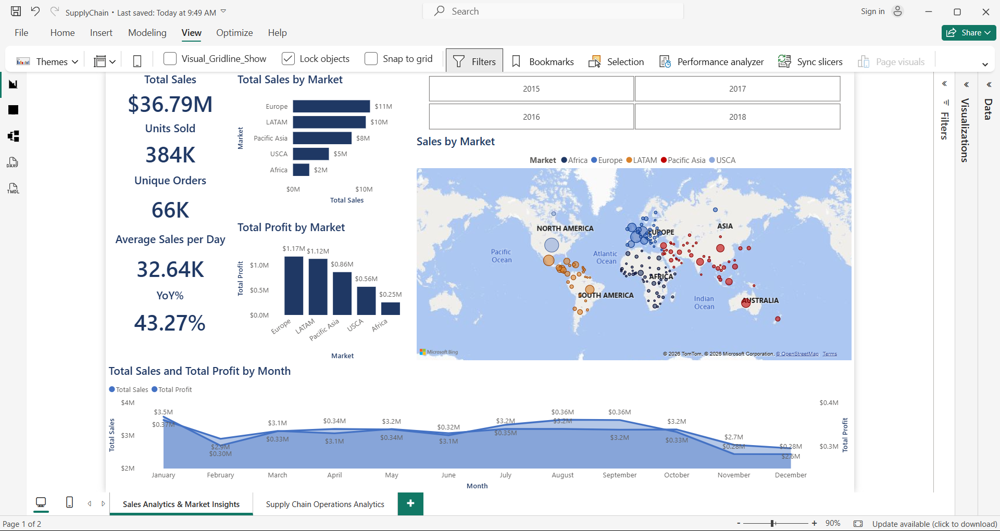
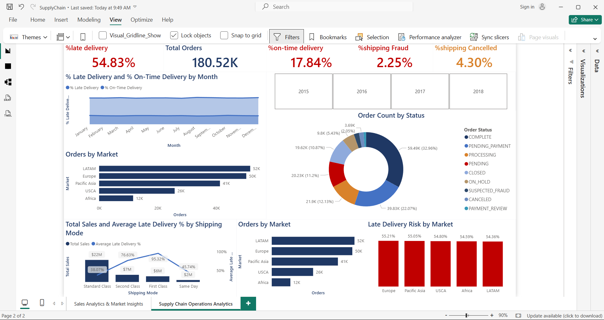

Supply-Chain-Sales-Dashboard
Interactive Power BI dashboard analyzing global supply chain sales and operations.
Supply Chain Analytics Dashboard (Power BI)

Project Overview

This project is an interactive Power BI dashboard designed to analyze global supply chain performance from 2015 to 2018. It provides insights into sales performance, profitability, delivery operations, and shipping efficiency through interactive visualizations and custom DAX measures.

The dashboard was created to demonstrate business intelligence, data modeling, and dashboard design skills using Power BI.

---

Business Objectives

This dashboard answers key business questions such as:

- Which markets generate the highest sales and profit?
- How has sales performance changed over time?
- What is the year-over-year (YoY) sales growth?
- Which shipping methods have the highest late delivery risk?
- What is the overall order fulfillment performance?
- What percentage of orders are delivered on time, cancelled, or affected by fraud?

---

Dashboard Pages

Supply Chain Operations Dashboard

Focuses on logistics and operational performance.

Key Metrics
- Late Delivery Rate
- On-Time Delivery Rate
- Shipping Cancellation Rate
- Shipping Fraud Rate
- Total Orders
- Average Order Value

Visualizations
- Monthly Delivery Performance
- Order Status Distribution
- Late Delivery Risk by Shipping Mode
- Shipping Performance Analysis

---

 Sales & Profit Performance Dashboard

Focuses on financial performance and market analysis.

Key Metrics
- Total Sales
- Total Profit
- Units Sold
- Unique Orders
- Average Sales per Day
- Sales Last Year
- Year-over-Year Sales Growth

Visualizations
- Sales by Market
- Geographic Sales Map
- Monthly Sales & Profit Trend
- Sales by Category
- Market Performance Comparison

---

Key Insights

- Europe generated the highest sales across all markets.
- Standard Class shipping handled the largest sales volume while also showing higher late delivery risk.
- Sales demonstrated positive year-over-year growth.
- The majority of orders were successfully completed.
- Geographic analysis highlights regional differences in sales performance and profitability.

---

Skills Demonstrated

- Power BI
- Data Modeling
- Data Cleaning & Transformation
- DAX Measures
- Time Intelligence
- KPI Development
- Interactive Dashboards
- Business Intelligence
- Data Visualization
- Geographic Analysis

---

DAX Measures

Some of the custom measures created for this project include:

- Total Sales
- Total Profit
- Units Sold
- Unique Orders
- Average Sales per Day
- Sales Last Year
- Sales YoY %
- Average Order Value
- Late Delivery %
- Shipping Cancellation %
- Shipping Fraud %

---

Dashboard Preview

Supply Chain Operations Dashboard



---

Sales & Profit Performance Dashboard



---

Dataset

This dashboard uses the **DataCo Global Supply Chain Dataset**.

Dataset Source:
https://www.kaggle.com/datasets/shashwatwork/dataco-smart-supply-chain-for-big-data-analysis
---

How to Use

1. Download the `SupplyChain.pbix` file.
2. Open it using Microsoft Power BI Desktop.
3. If prompted, reconnect the report to the original dataset.
4. Explore the dashboard using the interactive slicers and visualizations.

---

Project Structure

```
Supply-Chain-Analytics-Dashboard
│
├── README.md
├── SupplyChain.pbix
├── Dashboard1.png
└── Dashboard2.png
```

---

Author

Glen Steven Paulo Alcano

Aspiring Data Analyst | Power BI | SQL | Excel | Python

LinkedIn: https://linkedin.com/in/your-profile

GitHub: https://github.com/yourusername
